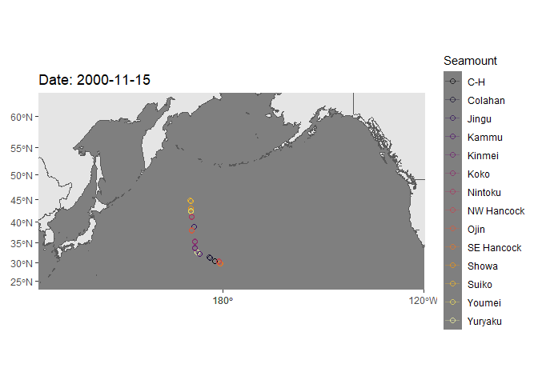
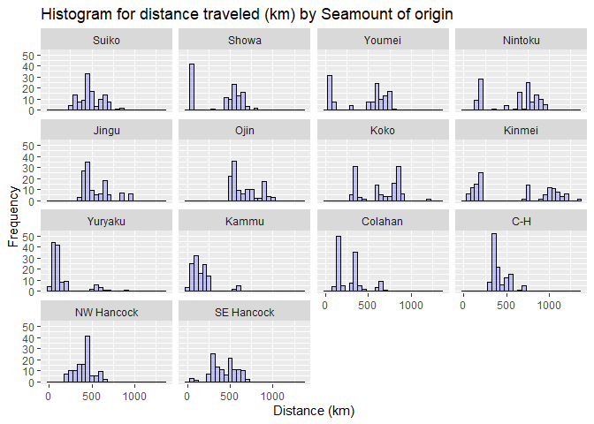
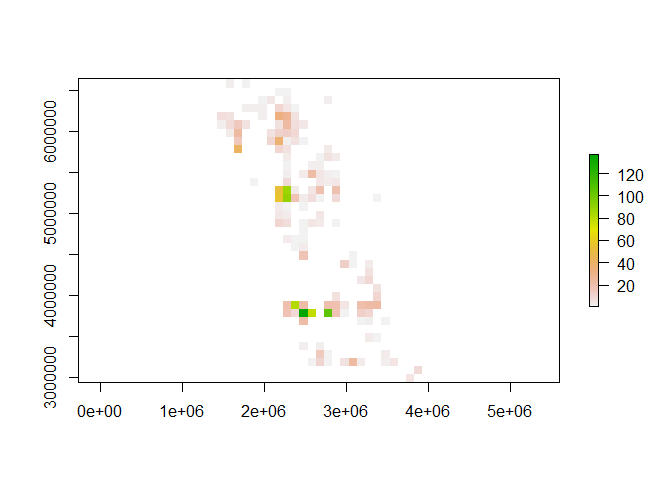
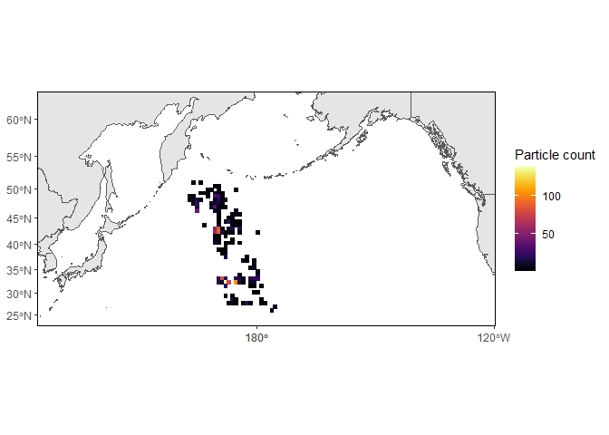

README
================
Chris Rooper
02 18, 2021

# NPA Larval Drift (NPALarvalDrift) Package

## Introduction and purpose

This package was developed as a way to process output from an Ocean
Parcels lagrangian particle tracking software. This particular version
is designed for use with Ocean Parcels trajectories for particles
released at multiple Emperor Seamounts (n = 14) on dates ranging from
November 15 to March 15 in each year (1993-2018). The underlying
velocity field is a GlobCurrent model downloaded from Copernicus
(<https://www.copernicus.eu/en/access-data/copernicus-services-catalogue/global-total-surface-and-15m-current-copernicus>).
The Ocean Parcels python packages (www.oceanparcels.org) were used to
generate net cdf files of particle positions on daily time steps. The
functions in this package process the net cdf files into digestible data
frames for further processing and analysis.

To install the package from github using the devtools package (this only
needs to be done once and again when updates to the package are pushed):

``` r
install.packages("devtools")

devtools::install_github("rooperc4/NPALarvalDrift")
```

Then install the libraries you will need for the examples

``` r
library(NPALarvalDrift)
library(ncdf4)
library(ggplot2)
library(gganimate)
library(sf)
library(rgdal)
library(proj4)
library(rnaturalearth)
library(gifski)
```

## Example code - Mapping the trajectories using the Particle\_trajectory function

In this example, an .nc file is processed using the Particle\_trajectory
function. This function parses the .nc data into a set of positions
(latitude and longitude) for each particle. It also assigns its source
seamount and the year of release. The data is then graphed and an
animation created for the particles.

Here’s the function to extract the data (example data included with the
package). In this version, I have specified the file name, the number of
days to track the particle (drift\_days=120) and the time interval in
days over which to keep the data (interval = 1). The time interval can
be changed to weekly by specifying interval=7. In this case the
locations of the particle will be taken once every 7 days. If the end
date is not divisible by the interval, the end position will also be
appended to the data. So for example if you have drift\_days = 120 and
interval = 7 the output data will include days 1,4,7,…,112,115,118,120.

``` r
temp<-system.file("extdata", "y00_d0.nc", package = "NPALarvalDrift")

data1<-Particle_trajectory(nc_file=temp,drift_days=120,interval=1)
```

    ## [1] ">>>> WARNING <<<  attribute _FillValue is an 8-byte value, but R"
    ## [1] "does not support this data type. I am returning a double precision"
    ## [1] "floating point, but you must be aware that this could lose precision!"

``` r
head(data1)
```

    ##        Lon      Lat       date Depth particle_id seamount year
    ## 1 170.3000 44.60000 2000-11-15     0        8498    Suiko 2000
    ## 2 170.0155 44.79488 2000-11-16     0        8498    Suiko 2000
    ## 3 169.8699 45.11551 2000-11-17     0        8498    Suiko 2000
    ## 4 169.7613 45.38564 2000-11-18     0        8498    Suiko 2000
    ## 5 169.7736 45.59005 2000-11-19     0        8498    Suiko 2000
    ## 6 169.6762 45.84758 2000-11-20     0        8498    Suiko 2000

Here is code that will make a plot of the particles on a base map.

``` r
#IMPORT THE BASEMAP AND TRANSFORM TO A NICER PROJECTION FOR THE NORTH PACIFIC
bg = ne_countries(scale = "medium",  returnclass = "sf")
bg1<-st_transform(bg,3832)

#TRANSFORM THE TRAJECTORIES TO THE SAME PROJECTION AND ADD THEM TO THE DATA SET
data2<-project(cbind(data1$Lon,data1$Lat),"+proj=merc +lon_0=150 +k=1 +x_0=0 +y_0=0 +datum=WGS84 +units=m +no_defs")
data1$LonP<-data2[,1]
data1$LatP<-data2[,2]

#MAKE A SET OF BOUNDARIES TO USE AS THE PLOTTING RANGE (LIMITS ON LONGITUDE AND LATITUDE)
data3<-data.frame(cbind(c(130,235),c(62,25)))
data3<-proj4::project(data3,"+proj=merc +lon_0=150 +k=1 +x_0=0 +y_0=0 +datum=WGS84 +units=m +no_defs")

#PLOT THE ENTIRE TRAJECTORY WITH THE MAP AS THE BACKGROUND
p<-ggplot()+
  #basemap
  geom_sf(data = bg1)+
  coord_sf(xlim = range(data3$x, na.rm = TRUE), 
           ylim = range(data3$y, na.rm = TRUE), 
           expand = TRUE)+
  
  # lines and points
  geom_path(data = data1, 
            aes(x=LonP,y=LatP,group=seamount,color=seamount), 
            alpha = 0.3)+
  geom_point(data = data1, 
             aes(x=LonP,y=LatP,group=seamount,color=seamount),
             alpha = 0.7, shape=21, size = 2)+
  
  # formatting
  scale_fill_viridis_d(option = "inferno")+
  scale_color_viridis_d(option = "inferno")+
  scale_size_continuous(range = c(0.1,14))+
  labs(x=NULL, y=NULL, 
       fill = 'Seamount', 
       color = 'Seamount')+
  theme_dark()+
  theme(panel.grid = element_blank())
```

Here is some code to animate the visualization.

``` r
#ANIMATE IT
anim = p + 
  transition_reveal(along = date)+
  ease_aes('linear',renderer=gifski_renderer())+
  ggtitle("Date: {frame_along}")
anim
```

<!-- -->

``` r
 #SAVE THE ANIMATION AS A GIF
anim_save("Daily200001_Depth0.gif",anim)
```

## Example code - Calculating the distance traveled and the final position using the Particle\_drift function

In this example, an .nc file is processed using the Particle\_drift
function. This function parses the .nc data into a beginning and end
position (latitude and longitude) for each particle. It also assigns its
source seamount and the year of release. It calculates both the
cumulative distance traveled and the straight line distance traveled by
the particle during its drift. The data is then graphed on a raster map
and with a histogram of distances for the year.

Here’s the function to extract the data (example data included with the
package). In this version, I have specified the file name and the number
of days to track the particle (drift\_days=120).

``` r
temp<-system.file("extdata", "y00_d0.nc", package = "NPALarvalDrift")

data1<-Particle_drift(nc_file=temp,drift_days=120)
```

    ## [1] ">>>> WARNING <<<  attribute _FillValue is an 8-byte value, but R"
    ## [1] "does not support this data type. I am returning a double precision"
    ## [1] "floating point, but you must be aware that this could lose precision!"

``` r
head(data1)
```

    ##   particle_id seamount year start_date   end_date start_lon start_lat  end_lon
    ## 1        8498    Suiko 2000 2000-11-15 2001-03-15     170.3      44.6 164.0429
    ## 2        8499    Showa 2000 2000-11-15 2001-03-15     170.4      43.0 169.8461
    ## 3        8500   Youmei 2000 2000-11-15 2001-03-15     170.4      42.3 169.8468
    ## 4        8501  Nintoku 2000 2000-11-15 2001-03-15     170.6      41.1 167.5145
    ## 5        8502    Jingu 2000 2000-11-15 2001-03-15     171.2      38.8 165.1847
    ## 6        8503     Ojin 2000 2000-11-15 2001-03-15     170.5      38.0 169.9556
    ##    end_lat distance cumulative_distance
    ## 1 51.15471 864.7617            1364.387
    ## 2 48.93252 661.0694            1245.335
    ## 3 48.93700 739.2708            1296.122
    ## 4 48.95159 905.9299            1381.514
    ## 5 46.00160 940.2348            1280.467
    ## 6 45.83089 871.9411            1369.912

Here is some code to make a histogram of the distance traveled.

``` r
p<-ggplot(data=data1,aes(x=distance)) + 
  geom_histogram(binwidth=50, 
                 col="black", 
                 fill="blue", 
                 alpha = .2) + 
  labs(title="Histogram for distance traveled (km) by Seamount of origin") +
  labs(x="Distance (km)", y="Frequency")

p+facet_wrap(~seamount)
```

<!-- -->

Here is some code to make a raster showing the density of larval end
points.

``` r
library(raster)
```

    ## Warning: package 'raster' was built under R version 3.6.2

    ## 
    ## Attaching package: 'raster'

    ## The following object is masked from 'package:gganimate':
    ## 
    ##     animate

``` r
library(rasterVis)
```

    ## Warning: package 'rasterVis' was built under R version 3.6.2

    ## Loading required package: lattice

    ## Loading required package: latticeExtra

    ## Warning: package 'latticeExtra' was built under R version 3.6.2

    ## 
    ## Attaching package: 'latticeExtra'

    ## The following object is masked from 'package:ggplot2':
    ## 
    ##     layer

``` r
library(viridis)
```

    ## Loading required package: viridisLite

``` r
#make points
end_points<-SpatialPoints(data.frame(data1$end_lon,data1$end_lat),proj4string=CRS("+proj=longlat +datum=WGS84"))

end_points<-SpatialPointsDataFrame(coords=end_points,data.frame(Count=rep(1,length(data1$end_lon))))
end_points
```

    ## class       : SpatialPointsDataFrame 
    ## features    : 1694 
    ## extent      : 162.719, 184.778, 25.47977, 51.29461  (xmin, xmax, ymin, ymax)
    ## crs         : +proj=longlat +datum=WGS84 +ellps=WGS84 +towgs84=0,0,0 
    ## variables   : 1
    ## names       : Count 
    ## min values  :     1 
    ## max values  :     1

``` r
newproj<-"+proj=merc +lon_0=150 +k=1 +x_0=0 +y_0=0 +datum=WGS84 +units=m +no_def"

extent_r<-projectExtent(end_points,newproj)
res(extent_r)<-100000
values(extent_r)<-1

end_points<-spTransform(end_points,newproj)

positions<-rasterize(end_points,extent_r,field="Count",fun="sum")
plot(positions)
```

<!-- -->

``` r
data3<-data.frame(cbind(c(-230,-125),c(25,62)))
data3<-proj4::project(data3,newproj)


bg1<-st_transform(bg,newproj)
positions_poly<-rasterToPolygons(positions)
p1<-st_as_sf(positions_poly)

g2<-ggplot()+geom_sf(data=bg1)+geom_sf(data=p1,aes(color=layer,fill=layer))+
  coord_sf(xlim = data3$x, 
           ylim = data3$y, 
           expand = TRUE)+scale_fill_viridis(option="inferno",name="Particle count")+scale_color_viridis(option="inferno",name="Particle count")+
          theme(panel.background = element_blank(),panel.grid=element_blank(),panel.border=element_rect(color="black",fill="transparent"))
  
  g2
```

<!-- -->
